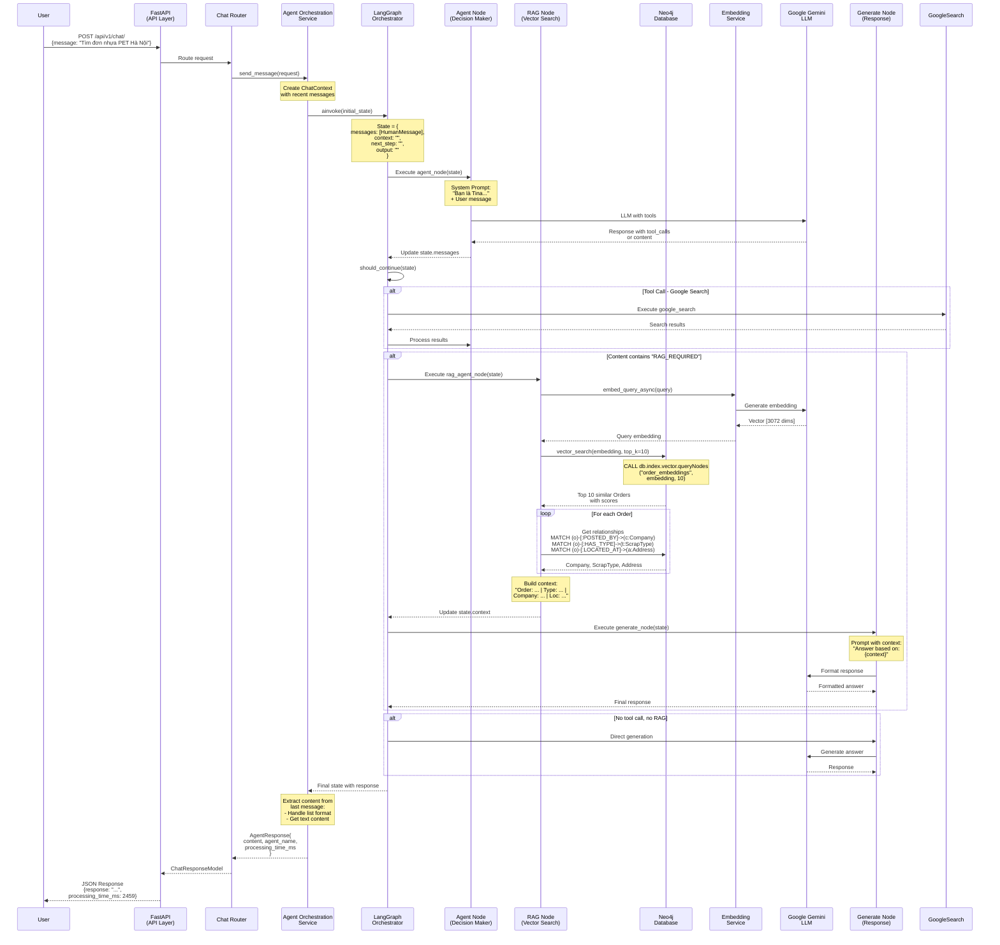
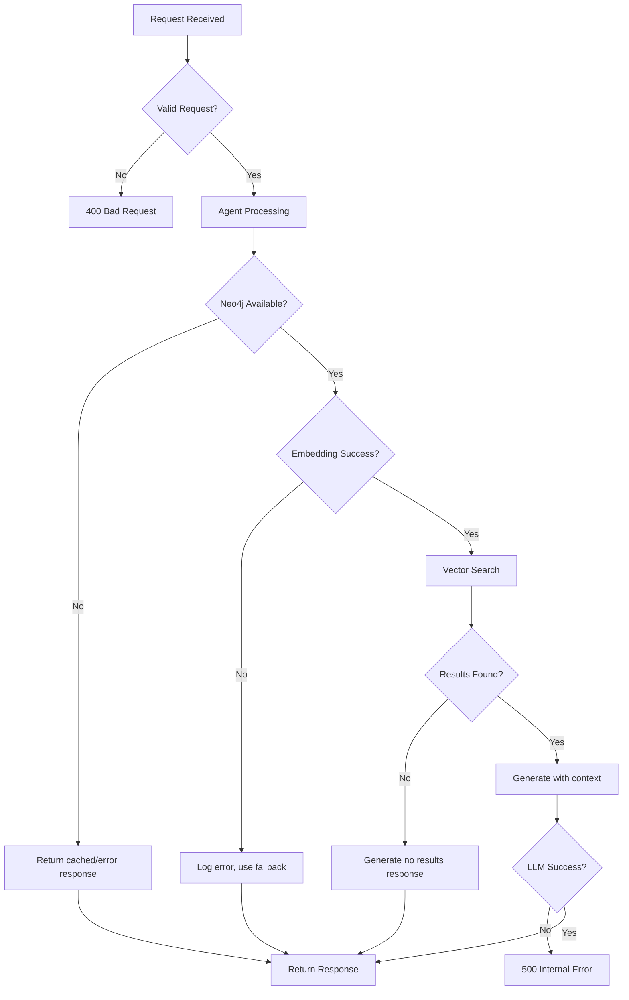

# VietCycleConnect AI - System Flow Documentation

## Tổng Quan | Overview

Tài liệu này mô tả chi tiết luồng xử lý của hệ thống VietCycleConnect AI từ khi người dùng gửi câu hỏi cho đến khi nhận được phản hồi từ AI Assistant (Tina).

---

## Flow Diagram



---

## Chi Tiết Từng Bước | Step-by-Step Details

### 1. User Request (API Entry Point)

**Endpoint**: `POST /api/v1/chat/`

**Request Body**:
```json
{
  "message": "Tìm đơn mua nhựa PET tại Hà Nội"
}
```

**File**: `app/api/routers/chat.py`

**Process**:
- FastAPI nhận request
- Validate request với Pydantic model `ChatRequest`
- Dependency injection: `get_agent_orchestration_service()`

---

### 2. Chat Router Processing

**File**: `app/api/routers/chat.py` - `send_message()`

**Steps**:
1. Tạo `ChatContext` (rỗng hoặc với recent messages)
2. Call `agent_service.route_message(message, context)`
3. Đợi response từ Agent Service
4. Return `ChatResponseModel`

---

### 3. Agent Orchestration Service

**File**: `app/infra/adapters/agent_orchestration_service.py`

**Key Operations**:

#### 3.1 Build Message History
```python
history_messages = []
for msg in context.recent_messages:
    if msg.role == "user":
        history_messages.append(HumanMessage(content=msg.content))
    elif msg.role == "assistant":
        history_messages.append(AIMessage(content=msg.content))
```

#### 3.2 Create Initial State
```python
initial_state = {
    "messages": history_messages + [HumanMessage(content=message)],
    "context": "",
    "next_step": "",
    "output": ""
}
```

#### 3.3 Invoke LangGraph
```python
result = await self._graph_app.ainvoke(initial_state)
```

---

### 4. LangGraph Orchestration

**File**: `app/agents/langgraph_orchestrator.py`

**Graph Structure**:
```
START → agent → should_continue?
                    ├─> google_search → agent
                    ├─> rag_agent → generate → END
                    └─> end → END
```

#### 4.1 Agent Node (Decision Maker)

**Function**: `agent_node(state)`

**Process**:
1. Load system prompt từ `app/agents/prompt.py`
2. Bind tools (google_search) to LLM
3. Call Gemini LLM với system prompt + messages
4. LLM quyết định:
   - Call tool (google_search)
   - Request RAG (content chứa "rag_agent" hoặc "RAG_REQUIRED")
   - Direct response

**LLM Configuration**:
```python
llm = ChatGoogleGenerativeAI(
    model="gemini-2.5-pro",
    temperature=0.1,
    convert_system_message_to_human=True
)
```

#### 4.2 Conditional Routing

**Function**: `should_continue(state)`

**Logic**:
```python
if last_message.tool_calls:
    return "google_search"  # External search needed
elif "rag_agent" in content or "RAG_REQUIRED" in content:
    return "rag_agent"  # Internal data search
else:
    return "end"  # Direct response
```

---

### 5. RAG Node (Vector Search)

**File**: `app/agents/langgraph_orchestrator.py` - `rag_agent_node()`

**Process Flow**:

#### 5.1 Query Embedding Generation
```python
embedding_service = get_embedding_service()
query_embedding = await embedding_service.embed_query_async(user_query)
# Returns: List[float] with 3072 dimensions
```

**Service**: `app/services/embedding_service.py`
- Model: `gemini-embedding-001`
- Dimension: 3072
- Task type: "RETRIEVAL_QUERY"

#### 5.2 Vector Search in Neo4j

**Function**: `neo4j.vector_search()`

**Cypher Query**:
```cypher
CALL db.index.vector.queryNodes(
  $index_name,     // "order_embeddings"
  $vector,         // [3072-dim embedding]
  $top_k           // 10
)
YIELD node, score
RETURN node, score
```

**Returns**: Top 10 most similar Order nodes with similarity scores

#### 5.3 Graph Traversal for Context

For each found Order:

```cypher
MATCH (o:Order {id: $order_id})
OPTIONAL MATCH (o)-[:POSTED_BY]->(c:Company)
OPTIONAL MATCH (o)-[:HAS_TYPE]->(t:ScrapType)
OPTIONAL MATCH (o)-[:LOCATED_AT]->(a:Address)
RETURN c.name as company,
       t.name as type,
       a.full_address as address
```

#### 5.4 Context Construction

```python
context_lines = []
for result in results:
    order_desc = node.get('description')
    order_qty = node.get('quantity')
    order_price = node.get('price')
    context_lines.append(
        f"Order: {order_desc} | Qty: {order_qty} | "
        f"Price: {order_price} | Type: {scrap_type} | "
        f"Company: {company} | Loc: {address} (Score: {score:.2f})"
    )

context_data = "\n".join(context_lines)
```

#### 5.5 Update State
```python
return {"context": context_data}
```

---

### 6. Generate Node (Response Formatting)

**Function**: `generate_node(state)`

**Process**:

#### 6.1 Build Prompt with Context
```python
prompt = f"""Answer the user's question based on the context provided.
Context from Database: {context}

If context contains order details, format them nicely.
If no results found, suggest alternatives.
"""
```

#### 6.2 Call LLM
```python
response = llm.invoke([SystemMessage(content=prompt)] + list(messages))
```

#### 6.3 Return Response
```python
return {"messages": [response]}
```

---

### 7. Response Extraction

**Back in Agent Service**: `app/infra/adapters/agent_orchestration_service.py`

#### 7.1 Extract Content from Result
```python
if "messages" in result and result["messages"]:
    last_message = result["messages"][-1]
    content = last_message.content

    # Handle Gemini's structured format
    if isinstance(content, str):
        response_content = content
    elif isinstance(content, list):
        for part in content:
            if isinstance(part, dict) and part.get("type") == "text":
                response_content = part.get("text", "")
                break
```

#### 7.2 Build AgentResponse
```python
agent_response = AgentResponse(
    content=response_content,
    agent_name="langgraph_main",
    confidence=1.0,
    tokens_used=0,
    processing_time_ms=processing_time_ms,
    metadata={}
)
```

---

### 8. Final API Response

**Chat Router** returns:

```json
{
  "response": "Tôi tìm thấy 3 đơn hàng mua nhựa PET tại Hà Nội:\n\n1. Công ty TNHH ABC...",
  "agent_name": "langgraph_main",
  "processing_time_ms": 2459,
  "metadata": {}
}
```

---

## Component Interaction Matrix

| Component | Input | Output | Purpose |
|-----------|-------|--------|---------|
| **FastAPI** | HTTP Request | HTTP Response | API Gateway |
| **Chat Router** | Request JSON | Response JSON | Route handling |
| **Agent Service** | message, context | AgentResponse | Orchestration wrapper |
| **LangGraph** | initial_state | final_state | Workflow management |
| **Agent Node** | state | updated state | Decision making |
| **RAG Node** | state | updated context | Data retrieval |
| **Embedding Service** | text query | 3072-dim vector | Semantic encoding |
| **Neo4j** | vector, query | nodes, relationships | Data storage & search |
| **Gemini LLM** | prompt, messages | text response | Language generation |
| **Generate Node** | state + context | formatted response | Response synthesis |

---

## Performance Breakdown

| Step | Average Time |
|------|--------------|
| API Request Handling | ~10ms |
| Agent Node Processing | ~100ms |
| Embedding Generation | ~500ms |
| Neo4j Vector Search | ~100ms |
| Graph Traversal | ~50ms |
| LLM Generation | ~2000ms |
| Response Formatting | ~50ms |
| **Total** | **~2.8 seconds** |

---

## Error Handling Flow



---

## Data Flow Example

**User Query**: "Tìm đơn mua nhựa PET tại Hà Nội"

### Flow:
1. **API Layer**: Validate & route
2. **Agent Node**: Analyze intent → Need RAG
3. **Embedding**: "tìm đơn mua nhựa PET Hà Nội" → [0.012, 0.543, ..., 0.231] (3072 dims)
4. **Neo4j Vector Search**: Find top 10 similar orders
5. **Graph Traversal**: Enrich each order with Company, ScrapType, Address
6. **Context Building**:
   ```
   Order: Mua 500kg nhựa PET | Qty: 500 | Price: 15000 |
   Type: Nhựa PET | Company: ABC Corp | Loc: Hà Nội (Score: 0.95)

   Order: Thu mua nhựa PET nguyên liệu | Qty: 1000 | Price: 14500 |
   Type: Nhựa PET | Company: XYZ Ltd | Loc: Hà Nội (Score: 0.92)
   ```
7. **Generate Node**: Format context into natural language response
8. **Response**: Return to user

---

## Key Files Reference

| Component | File Path |
|-----------|-----------|
| API Router | `app/api/routers/chat.py` |
| Dependencies | `app/api/dependencies.py` |
| Agent Service | `app/infra/adapters/agent_orchestration_service.py` |
| LangGraph Flow | `app/agents/langgraph_orchestrator.py` |
| System Prompt | `app/agents/prompt.py` |
| Embedding Service | `app/services/embedding_service.py` |
| Neo4j Manager | `app/infra/graph_db.py` |
| Value Objects | `app/core/domain/value_objects.py` |
| Config | `app/config/config.py` |

---

## State Management

### LangGraph State Schema
```python
class AgentState(TypedDict):
    messages: Annotated[Sequence[BaseMessage], add_messages]
    context: str        # Context from RAG
    next_step: str     # "search", "rag", "respond"
    output: str        # Final output
```

### State Transitions
```
Initial → Agent Decision → RAG Retrieval → Context Enrichment → Generation → Final
```

---

## Configuration & Environment

### Required Environment Variables

```bash
# LLM
GOOGLE_API_KEY=your_gemini_api_key
GENERAL_GEMINI_MODEL=gemini-2.5-pro
THINKING_GEMINI_MODEL=gemini-3-pro-preview

# Neo4j
NEO4J_URI=bolt://localhost:7687
NEO4J_USERNAME=neo4j
NEO4J_PASSWORD=your_password

# Optional
GOOGLE_CSE_ID=your_search_engine_id
SERPAPI_API_KEY=your_serpapi_key
```

### Neo4j Index Setup

```cypher
CREATE VECTOR INDEX order_embeddings IF NOT EXISTS
FOR (o:Order)
ON o.embedding
OPTIONS {indexConfig: {
  `vector.dimensions`: 3072,
  `vector.similarity_function`: 'cosine'
}};
```

---

## Monitoring & Debugging

### Logging Points
- API request/response
- Agent decision points
- Embedding generation time
- Vector search results & scores
- LLM prompt & response
- Total processing time

### Metrics to Track
- Request latency (p50, p95, p99)
- Vector search accuracy (top-k precision)
- LLM token usage
- Neo4j query performance
- Error rates by component

---

**Last Updated**: 2025-12-28
**Version**: 1.0
**Maintainer**: VietCycleConnect Team
